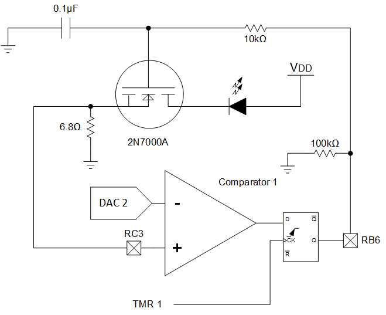
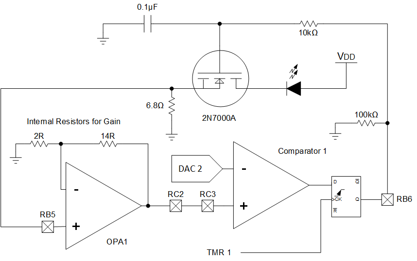

<!-- Please do not change this html logo with link -->

# Switching LED Current Regulator using PIC18F16Q41
This code example implements a linear low-side current regulator for LEDs using the PIC18F16Q41's digital-to-analog converter (DAC), comparator, and a handful of external components. The operational amplifier (OPA) module on the PIC18F16Q41 can be used in this demo to reduce the maximum current output range of the circuit.

## Related Documentation
TBxxxx, "Using Operational Amplifiers in PIC16 and PIC18" 
TBxxxx, "Optimizing Internal Operational Amplifiers for Analog Signal Conditioning" 
ANxxxx, "Analog Sensor Measurement and Acquisition"

<a href="https://github.com/microchip-pic-avr-examples/pic18f16q41-linear-led-current-regulator">Code Example: Linear LED Current Regulator using PIC18F16Q41</a>

The following documents and resources will be published soon.
## Software Used

* <a href="http://www.microchip.com/mplab/mplab-x-ide">MPLAB® IDE 5.40 or newer</a>
* <a href="https://www.microchip.com/mplab/compilers">Microchip XC8 Compiler 2.20 or newer</a>
* <a href="https://www.microchip.com/mplab/mplab-code-configurator">MPLAB® Code Configurator (MCC) 3.95.0 or newer</a>

## Hardware Used

* <a href="https://www.microchip.com/wwwproducts/en/PIC18F16Q41">PIC18F16Q41</a> 
* <a href="https://www.microchip.com/DevelopmentTools/ProductDetails/PartNO/DM164137"> Microchip Curiosity Development Board (DM164137) </a>

## External Parts Required

* 6.8 ohm resistor (current shunt)
* *(Optional)* 100k resistor
    * This resistor discharges the capacitor passively and ensures the MOSFET remains off if the part is off or the pin is tri-stated. For this example, it is not needed.
* 10k resistor
* 0.1uF capacitor
* N-Type MOSFET (rec. signal transistor, such as a 2N7000A)
* LED

#### Power Dissipation
Before building or operating this demo, ensure that the parts selected for this demo are appropriately rated for the peak power of this circuit.

The parts that dissipate the most power are the 6.8 ohm shunt resistor, the MOSFET, and the LED. Some parts **may become warm or hot** during operation.

## Wiring
#### Simple Wiring Diagram
 

#### Amplified Wiring Diagram
 

#### Required Connections

| Pin | Function
| --- | --------
| RB6 | Comparator Output (connect to the RC network)
| RC3 | Current Sense Input

#### Current Sense Amplifier Connections

If using the current sense amplifier to reduce the current range, the following pins are also needed.

| Pin | Function
| --- | --------
| RB5 | OPA1IN0+ (connect to the current shunt)
| RC2 | OPA1OUT (connect to RC3)

## Operation
This code example regulates the current through the LED(s) to generate a breathing effect. The MOSFET acts as a voltage-controlled current sink. To set the voltage on the MOSFET's gate, and thus the current through the transistor, the comparator compares the voltage on the current shunt (RC3) with the DAC's level. If the current sensed is less than the set level, the comparator turns on. When the current sensed is greater than or equal to the DAC level, then the comparator turns off. The signal is integrated through the 10k and 0.1uF RC network on the gate of the MOSFET to regulate the transistor.

The comparator is used in synchronous mode with a flip-flop to reduce the switching noise of this regulator.

To generate the breathing effect, the DAC output generates a triangle wave which sets the current output through the following formula:

**Iout = Vdac / (6.8 x Gain)**

In the unamplified (or gain of 1) configuration, the maximum current is **~150.8mA**, assuming no limitations from the power supply.

By using the OPA module in a gain of 8 reduces the current output range to a maximum of **~18.85mA**.

 
*Voltage Across the Sense Resistor*

#### Short Circuit Protection
Due to the MOSFET acting as voltage controlled current sink, there is some short circuit protection built into the circuit. However, it is not recommended to depend on this circuit as the only means of protection. Prolonged short circuits may cause heating.

## High Voltage Operation
This code example can be run at voltages in excess of Vdd. Running at a higher voltage enables more LEDs to be strung together in series. However, some circuit modifications should be made to handle the higher voltages and power.

**Important!** If an I/O associated with the PIC18F16Q41 exceeds Vdd or Vss, then the device will be permanently damaged.

## Summary
With a few external parts, the analog peripherals on the PIC18F16Q41 can be used to control the current through an LED.
