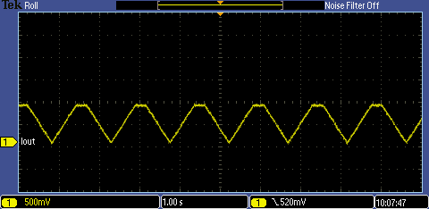

<!-- Please do not change this html logo with link -->

# Switching LED Current Regulator using PIC18F16Q41
The digital-to-analog converter (DAC) and comparator on the PIC18F16Q41 are a powerful combination of peripherals that can be combined with a few external parts in order to implement a low-side constant current regulator for LEDs.

## Related Documentation

<a href="https://www.microchip.com/wwwproducts/en/PIC18F16Q41">PIC18F16Q41 Product Information</a> 
TBxxxx, "Using Operational Amplifiers in PIC16 and PIC18" 
TBxxxx, "Optimizing Internal Operational Amplifiers for Analog Signal Conditioning" 
ANxxxx, "Analog Sensor Measurement and Acquisition"

<a href="https://github.com/microchip-pic-avr-examples/pic18f16q41-linear-led-current-regulator">Code Example: Linear LED Current Regulator using PIC18F16Q41</a>

## Software Used

* <a href="http://www.microchip.com/mplab/mplab-x-ide">MPLAB® IDE 5.40 or newer</a>
* <a href="https://www.microchip.com/mplab/compilers">Microchip XC8 Compiler 2.20 or newer</a>
* <a href="https://www.microchip.com/mplab/mplab-code-configurator">MPLAB® Code Configurator (MCC) 3.95.0 or newer</a>

## Hardware Used

* <a href="https://www.microchip.com/DevelopmentTools/ProductDetails/PartNO/DM164137"> Microchip Curiosity Development Board (DM164137) </a>

## External Parts Required

* 6.8 ohm resistor (current shunt)
* *(Optional)* 100k resistor
    * This resistor discharges the capacitor passively and ensures the MOSFET remains off if the part is off or the pin is tri-stated. For this example, it is not needed.
* 10k resistor
* 0.1uF capacitor
* N-Type MOSFET (rec. signal transistor, such as a 2N7000A)
* LED

#### Power Dissipation
Before building or operating this demo, ensure that the parts selected for this demo are appropriately rated for the peak power of this circuit.

The parts that dissipate the most power are the 6.8 ohm shunt resistor, the MOSFET, and the LED. Some parts **may become warm or hot** during operation.

## Wiring
 

| Pin | Function
| --- | --------
| RA2 | DAC1 Output (connect to RA0 for the LED to breathe)
| RA0 | Current Set (Voltage input)
| RC3 | Current Sense Input
| RC0 | Potentiometer Pin on the Curiosity (connect to RA0 for manual intensity control)

**Important:** RA0 must be connected to a signal (RA2 or RC0) for proper operation.

## Operation
This code example regulates the current through the LED(s) to generate a breathing effect. The MOSFET acts as a voltage-controlled current sink. To set the gate voltage, and thus the current through the transistor, the comparator compares the voltage on the current shunt (RC3) with the DAC's level. If the current sensed is less than the set level, the comparator turns on. When the current sensed is greater than or equal to the DAC level, then the comparator turns off.

The comparator is used in synchronous mode with a D flip-flop to reduce the switching noise. The output is integrated through the 10k and 0.1uF RC network on the gate of the MOSFET.

To generate the breathing effect, the DAC output generates a triangle wave which sets the current output through the following formula:

**Iout = Vdac / 6.8**

The maximum output of this setup is **150.8mA**, assuming no limitations from the power supply.

 
*Current through the MOSFET*

#### Short Circuit Protection
Due to the MOSFET acting as voltage controlled current sink, there is some short circuit protection built into the circuit. However, it is not recommended to depend on this circuit as the only means of protection. Prolonged short circuits may cause heating.

## Reducing the Maximum Current
To reduce the maximum current through the LED (without changing the value of the shunt), the operational amplifier (OPA) module can be used to multiply the shunt voltage, lowering the current limit.

## High Voltage Operation
This code example can be run at voltages in excess of Vdd. Running at a higher voltage enables more LEDs to be strung together in series. However, some circuit modifications should be made to handle the higher voltages and power.

**Important!** If an I/O associated with the PIC18F16Q41 exceeds Vdd or Vss, then the device will be permanently damaged.

## Summary
This code example demonstrates the use of the comparator and DAC on the PIC18F16Q41 to control the current through LED(s) with little CPU overhead required.  
